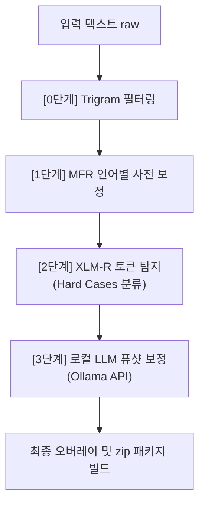

# MultiLexNorm2026

**MultiLexNorm 2026**은 소셜 미디어나 모바일 메신저 등에서 사용되는 다양한 다국어 구어체 비표준 어휘(줄임말, 구어체 표현, 오탈자, 방언 등)를 표준 어휘로 변환하는 **다국어 어휘 정규화(Lexical Normalization) 과제**를 해결하기 위한 팀 프로젝트 레포지토리입니다.

본 프로젝트는 전통적인 통계식 기법, 언어별 수동 규칙 사전, 딥러닝 기반 탐지기, 그리고 거대 언어 모델(LLM)을 유기적으로 연동한 **하이브리드 4단계 파이프라인**을 구축하여 최종 성능을 극대화합니다.

---

## 🛠️ 프로젝트 및 파이프라인 아키텍처

우리의 시스템은 성능 향상과 리소스 효율성을 극대화하기 위해 다음과 같은 **4단계 파이프라인**으로 작동합니다.



### 1단계별 핵심 아키텍처 설명
* **0단계: Trigram (`trigram_predictor.py`)**
  * 대규모 통계적 사전을 활용하여 가장 확실하고 빈번한 변환 대상을 빠른 속도로 1차 정규화합니다.
* **1단계: MFR Dictionary (`smart_guard_mfr_v2.py` / `prompt_mfr_adapter.py`)**
  * 언어별로 정밀하게 정의된 다국어 규칙(Multi-word Rule)을 적용하여 정밀 매핑 및 오인 방지 가드 역할을 수행합니다.
* **2단계: XLM-R 탐지 (`detection.py` / `mine_hard_cases_dev.py`)**
  * 사전 단계에서 걸러지지 않았거나 표준어처럼 생겼지만 문맥상 수정이 필요한 까다로운 패턴(Hard Cases)을 XLM-R 토큰 분류 모델을 통해 정교하게 마이닝합니다.
* **3단계: LLM 보정 (`normalization_fewshot.py` / `llm_correct_local.py`)**
  * 탐지된 고난도 어휘(Hard Cases)에 대해서만 로컬 LLM(Ollama 백엔드)을 호출하여 다국어 문맥 유사도 기반 퓨샷(Few-shot) 프롬프팅을 거쳐 최종 교정을 수행합니다. 이를 통해 API 비용과 추론 속도를 획기적으로 절약합니다.

---

## 🚀 최종 파이프라인 실행 및 제출물 빌드 가이드

진석님이 정립한 3개의 스크립트 기반 최종 파이프라인 구동 및 CodaBench 제출용 파일(.zip) 생성 절차입니다. 

> [!IMPORTANT]  
> 2단계를 진행하려면 로컬 혹은 가상환경 상에 **Ollama 데몬(또는 OpenAI 호환 LLM 서버)**이 켜져 있어야 합니다.

### Step 1: 하드 케이스 마이닝 및 탐지 (`mine_hard_cases_dev.py`)
Trigram 및 MFR 베이스라인을 연산하고, 2단계 XLM-R 검출 모델을 구동하여 LLM이 집중 치료해야 할 타겟 토큰들만 선별(마이닝)합니다.
```bash
python mine_hard_cases_dev.py
```
* **주요 입력**: `outputs/submission_dev/predictions.json` (개발 셋 원본)
* **주요 출력**: `outputs/hard_cases_dev.jsonl` (LLM 보정용 Hard Cases 후보 목록)

### Step 2: 로컬 LLM 연동 보정 (`llm_correct_local.py`)
1단계에서 골라낸 고난도 단어들에 대해 로컬 LLM 서버에 동적 퓨샷 프롬프트를 보내 최종 수정 제안을 수집합니다.
```bash
python llm_correct_local.py --model [OLLAMA_MODEL_NAME] --output llm_corrections_dev_fewshot3.jsonl --fewshot
```
* **인자 설명**:
  * `--model`: 로컬 Ollama에 로드된 모델 식별자 (예: `gemma2:9b` 등)
  * `--fewshot`: 유사도 기반 다국어 퓨샷 예시를 활성화하는 옵션
* **주요 출력**: `outputs/llm_corrections_dev_fewshot3.jsonl` (LLM의 정규화 보정 결과물)

### Step 3: 최종 오버레이 및 zip 빌드 (`build_dev_submissions.py`)
기본 베이스라인 결과 위에 LLM이 제안한 최종 보정본을 정확하게 오버레이하여 CodaBench 제출 양식에 맞추어 압축합니다.
```bash
python build_dev_submissions.py
```
* **주요 출력**: `outputs/submissions_dev_final/` 디렉토리 아래의 최종 `predictions.json` 및 CodaBench 업로드용 `.zip` 패키지 파일

---

## 📂 프로젝트 폴더 구조 및 파일 맵

```text
MultiLexNorm2026/
├── baseline/
│   ├── LAI_baseline.py          # LAI 기반 베이스라인
│   ├── MFR_baseline.py          # MFR 사전 기반 베이스라인
│   ├── ByT5_baseline.py         # ByT5 생성 모델 베이스라인
│   └── evaluate_all.py          # [Dashboard] 전체 모델 공식 메트릭 성능 집계 대시보드
├── multilexnorm2026-dataset/
│   ├── dataset_12lang/          # 12개 국어 다국어 Parquet 데이터셋
│   └── dataset_17lang/          # 17개 국어 다국어 Parquet 데이터셋
├── multilexnorm_eval_package/
│   └── multilexnorm_evaluator.py # [공식 평가 패키지] 수정 절대 금지 (공식 수학 연산식 탑재)
├── prompt_mfr_dictionary/       # 다국어 프롬프트 템플릿 및 언어별 MFR 규칙 자료 리소스
├── paths_config.py              # [중앙 집중 경로] 로컬/Colab 환경 자동 경로 바인딩 모듈
├── evaluation.py                # [통합 평가 브릿지] 공식 평가 패키지와 기존 메트릭 구조 완벽 연동
├── detection.py                 # 2단계: XLM-R 기반 토큰 단위 비정규화 탐지 모듈
├── normalization_fewshot.py     # 3단계: LLM 기반 다국어 퓨샷(Few-shot) 보정 모듈
├── trigram_predictor.py         # 0단계: 문맥 기반 트라이그램(Trigram) 사전 필터링 모델
├── smart_guard_mfr_v2.py        # 1단계: MFR 사전 기반 필터링 및 백업 전략 로직
├── prompt_mfr_adapter.py        # MFR 딕셔너리 및 프롬프트 연동 어댑터
├── run_mfr_xlmr_experiment.py   # MFR 사전 + XLM-R 탐지 결합 실험 실행 스크립트
├── mine_hard_cases_dev.py       # [Step 1] XLM-R 기반 하드케이스 마이닝 도구
├── llm_correct_local.py         # [Step 2] 로컬 LLM 최종 보정 파이프라인 연계 스크립트
├── build_dev_submissions.py     # [Step 3] 최종 제출 포맷 빌드 및 패키징 스크립트
└── requirements.txt             # 프로젝트 주요 의존성 목록
```

---

## 🛠️ 핵심 설계 철학

1. **유연한 실행 환경 (`paths_config.py`)**:
   * 실행 환경(Local / Google Colab)을 스스로 판단하여 파이썬 검색 경로(`sys.path`)를 자동 정렬하므로 별도 코드 수정 없이 즉시 호환됩니다.
2. **공식 메트릭의 일원화 (`evaluation.py`)**:
   * 모든 모델의 내부 평가(precision, recall, f1, err)는 `multilexnorm_eval_package`를 경유하도록 설계되어 수학적으로 공식 검증 결과와 100% 동일함을 보장합니다.

---

## 📝 협업 가이드라인

* **브랜치 활용**: 핵심 기능 변경 및 실험은 작업 브랜치(`reducing_over_normalized`)에서 검증 완료 후, PR(Pull Request)을 거쳐 `main` 브랜치에 안전하게 합칩니다.
* **임시 파일 정리**: 대용량 모델 웨이트나 한 번만 실행하는 테스트 로그들은 `.gitignore` 파일에 정의되어 업로드가 차단되므로 깃허브 공간을 언제나 깨끗하게 유지할 수 있습니다.
