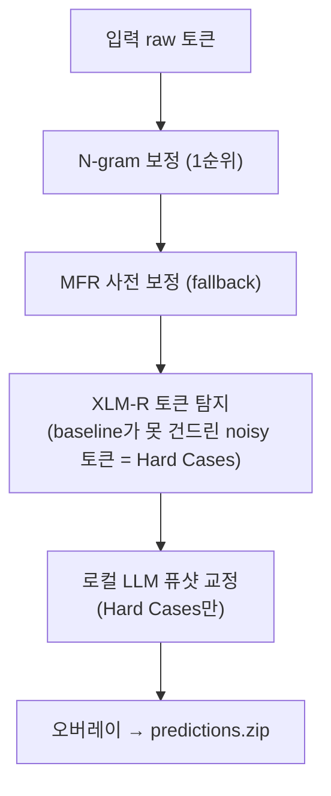

# MultiLexNorm 2026

homework 11th team submission codefile

N-gram -> MFR -> XLM-R -> LLM

---------

## Pipeline Architecture

4개 모듈이 **베이스라인 보정 → 하드케이스 탐지 → LLM 교정 → 오버레이 빌드** 순으로 작동합니다.



우선순위는 **N-gram → MFR → 원본 유지**(token이 N-gram에서 바뀌면 그대로, 아니면 MFR, 둘 다 안 바뀌면 raw). LLM은 baseline이 손대지 않았으면서 동시에 XLM-R이 noisy로 표시한 토큰(Hard Cases)에 대해서만 호출되어 비용·시간을 절약합니다.

### 모듈별 설명

| 모듈 | 파일 | 역할 |
|---|---|---|
| **N-gram** | `trigram_predictor.py` | 문맥 통계로 1순위 보정. trigram → bigram(좌/우) back-off chain. |
| **MFR 사전** | `smart_guard_mfr_v2.py` | 토큰별 최빈 정규화(Most Frequent Replacement) lookup + 보호 가드. |
| **XLM-R 탐지** | `detection.py` | 토큰 단위 noise 분류기. baseline가 놓친 Hard Cases 마이닝. |
| **LLM 교정** | `llm_correct_local.py`, `normalization_fewshot.py`, `prompt_mfr_adapter.py` | Hard Cases에 동적 퓨샷 프롬프트로 최종 교정. |

### 현재 채택 설정

- **N-gram**: `variant=tri_bi_both`, `conf_min=0.70`, `protect=non_protect` (ablation으로 선정 — `ablation_trigram.py`로 재현)
- **XLM-R**: `../checkpoint-7347` (fine-tuned), threshold 0.5
- **LLM**: `gemma4:latest` (Gemma4 : E4B, Q4_K_M), `--fewshot --pos-k 3 --neg-k 0`, temperature=0 / seed=42, workers=2

---

## 🚀 실행 가이드 (3-스크립트 파이프라인)

> [!IMPORTANT]
> LLM 단계는 로컬 **Ollama 데몬**(또는 OpenAI 호환 LLM 서버)이 실행 중이어야 합니다.

입출력 경로는 CLI 인자가 아니라 **`paths_config.py` 상단 상수**로 지정합니다. 실험을 바꿀 때는 아래 상수만 편집하세요.

```python
# paths_config.py
MINE_INPUT_PATH  = ... # mine 입력 (.parquet 또는 .json)
HARD_CASES_PATH  = ... # Stage 1 → 2 hard cases jsonl
BASELINE_PATH    = ... # Stage 1 → 3 baseline json
LLM_OUTPUT_PATH  = ... # Stage 2 LLM 교정 결과 jsonl (= Stage 3 입력)
SUBMISSION_DIR   = ... # Stage 3 최종 출력 디렉터리
```

### Stage 1 — 하드케이스 마이닝 (`mine_hard_cases_dev.py`)
Trigram·MFR 베이스라인을 계산하고 XLM-R로 Hard Cases를 선별합니다.
```bash
python mine_hard_cases_dev.py            # tri+mfr (기본)
python mine_hard_cases_dev.py --no-trigram   # mfr만
python mine_hard_cases_dev.py --no-mfr       # tri만
python mine_hard_cases_dev.py --mfr-first    # MFR 우선순위
```
- 입력: `MINE_INPUT_PATH`
- 출력: `HARD_CASES_PATH`, `BASELINE_PATH`

### Stage 2 — 로컬 LLM 교정 (`llm_correct_local.py`)
```bash
python llm_correct_local.py --model gemma4:latest --fewshot --pos-k 3 --neg-k 0
```
- 입력: `HARD_CASES_PATH`
- 출력: `LLM_OUTPUT_PATH`
- 주요 인자: `--workers`(기본 2), `--pos-k`/`--neg-k`(퓨샷 개수), `--no-json-format`

### Stage 3 — 오버레이 및 빌드 (`build_dev_submissions.py`)
baseline 위에 LLM 교정을 오버레이하고 CodaBench용 zip을 만듭니다.
```bash
python build_dev_submissions.py          # baseline + LLM
python build_dev_submissions.py --no-llm # baseline만 (LLM 생략)
```
- 입력: `BASELINE_PATH`, `HARD_CASES_PATH`, `LLM_OUTPUT_PATH`
- 출력: `SUBMISSION_DIR/predictions.{json,zip}`

---

## 🔧 보조 스크립트

| 스크립트 | 용도 |
|---|---|
| `build_trigram_stats.py` | train parquet → `outputs/trigram_stats.pkl.gz` (trigram/biL/biR 통계 빌드) |
| `ablation_trigram.py` | N-gram (variant × conf_min × protect) 그리드 ablation. tri-only / full 모드. → CSV |
| `run_mfr_xlmr_experiment.py` | MFR + XLM-R 결합 실험 |
| `baseline/evaluate_all.py` | LAI / MFR / ByT5 베이스라인 메트릭 대시보드 |

평가는 `multilexnorm_eval_package_v2`(다중 뷰: `--eval_groups all official12 missing5`)로 수행합니다.

```bash
python multilexnorm_eval_package_v2/multilexnorm_evaluator_v2.py evaluate \
  --gold_parquet multilexnorm2026-dataset/validation-00000-of-00001.parquet \
  --pred_path outputs/<submission>/predictions.json \
  --model_name <name> --dataset_name val12lang \
  --eval_groups all official12 missing5 \
  --out_dir multilexnorm_eval_package_v2/outputs/results
```

---

## 📂 폴더 구조

```text
MultiLexNorm_HW11/
├── multilexnorm2026-dataset/        # train/val/test parquet (train 17개 언어, val 12개 언어)
│   └── mini_validation/
├── baseline/                        # LAI · MFR · ByT5 베이스라인 + evaluate_all.py
├── multilexnorm_eval_package_v2/    # 평가기 (eval_groups 다중 뷰)
├── prompt_mfr_dictionary/           # 언어별 MFR 사전 + LLM 프롬프트 리소스
├── outputs/                         # 파이프라인 산출물 + trigram_stats.pkl.gz
├── bin/                             # 아카이브 (구 17lang 데이터·실험·평가기 v1·보고서 자료)
│
├── paths_config.py                  # [중앙 경로] 모든 I/O 경로 상수
├── trigram_predictor.py             # N-gram 예측기 (trigram → bigram back-off)
├── build_trigram_stats.py           # N-gram 통계 빌더
├── smart_guard_mfr_v2.py            # MFR 사전 보정 + 보호 가드
├── prompt_mfr_adapter.py            # MFR 사전 ↔ LLM 프롬프트 어댑터
├── detection.py                     # XLM-R 토큰 noise 탐지기
├── normalization_fewshot.py         # 동적 퓨샷 검색기
├── mine_hard_cases_dev.py           # [Stage 1] 하드케이스 마이닝
├── llm_correct_local.py             # [Stage 2] 로컬 LLM 교정
├── build_dev_submissions.py         # [Stage 3] 오버레이 + zip 빌드
├── ablation_trigram.py              # N-gram ablation 그리드 러너
├── run_mfr_xlmr_experiment.py       # MFR+XLM-R 실험
├── evaluation.py                    # 공식 평가기 연동 브릿지
├── mfr_stats.pkl.gz                 # MFR 통계 (predict용 lookup table)
└── requirements.txt
```

---

## 📊 데이터셋 메모

- `multilexnorm2026-dataset/`는 단일 데이터셋(`train`/`validation`/`test` parquet).
- train 39,178행(17개 언어), validation 8,408행(12개 언어: de/en/hr/id/iden/ja/ko/nl/sl/sr/th/vi).
- val에 없는 5개 언어(da/es/it/tr/trde)는 평가 시 `missing5`/`official12` 분리 뷰로 따로 확인.
- 통계 파일(`mfr_stats.pkl.gz`, `trigram_stats.pkl.gz`)은 train 전체(640,984 토큰)를 반영.

---

## 🧱 핵심 설계 원칙

1. **경로 일원화 (`paths_config.py`)** — 모든 입출력 경로를 한 곳의 상수로 관리. 실험 전환은 상수 편집만으로 처리.
2. **공식 메트릭 일치 (`evaluation.py` + `multilexnorm_eval_package_v2`)** — 내부 평가(precision/recall/f1/err)가 공식 평가기와 동일하도록 연동.
3. **비용 효율 LLM 호출** — XLM-R이 탐지한 Hard Cases에만 LLM을 호출하여 추론 비용·시간 최소화.
